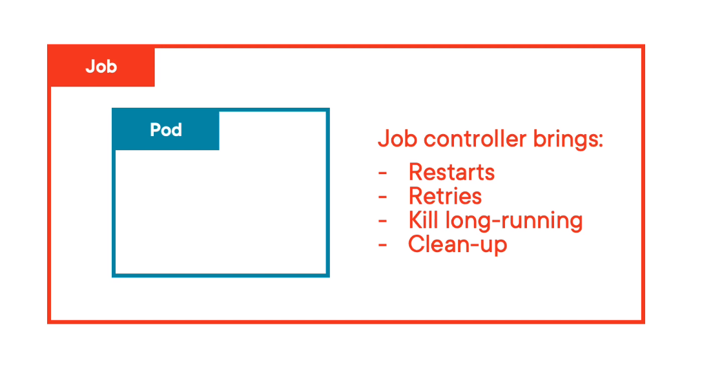

# Jobs & cronjobs

## Jobs
Ensure one or more Pods completes successfully.
* Run set number of Pods to _completion_.
* Managed by a controller
* can run Pods in parallel
* offer intelligence



We create a job that creates a pod, the pod then executes, but with the job watching and then when pod's done, the job cleans up and completes. When the pod fails the whole point of job is to offer some help.

```yaml
apiVersion: batch/v1
kind: Job
metadata:
  name: pi
spec:
  activeDeadlineSeconds: 10
  ttlSecondsAfterFinished: 120
  completions: 5
  parallelism: 1
  backoffLimit: 4
  template:
    spec:
      containers:
      - name: pi
        image: perl:5.34.0
        command: ["perl",  "-Mbignum=bpi", "-wle", "print bpi(2000)"]
      restartPolicy: Never
```
* _activeDeadlineSeconds_ - if the pod is still running after X sec kill it
* _ttlSecondsAfterFinished_ - if the JOB is still running after X sec, kill it
* _completions_ - nr of pods we want to run
* _parallelism_ - run x at a time (1 = no parallelism)
* _backoffLimit_ - max nr of restarts
* _restartPolicy_ can be:
  * Never  - failed pods are not restarted, this is good if you want to read logs
  * OnFailure - allows restart up to _backoffLimit_

## Cronjobs
Jobs running on schedule.

```yaml
apiVersion: batch/v1
kind: CronJob
metadata:
  name: hello
spec:
  schedule: "* * * * *"
  startingDeadlineSeconds: 30
  concurrencyPolicy: Allow
  successfulJobsHistoryLimit: 5
  failedJobsHistoryLimit: 2
  jobTemplate:
    spec:
      template:
        spec:
          containers:
          - name: hello
            image: busybox:1.28
            imagePullPolicy: IfNotPresent
            command:
            - /bin/sh
            - -c
            - date; echo Hello from the Kubernetes cluster
          restartPolicy: OnFailure

```

* _startingDeadlineSeconds_ - This field defines a deadline (in whole seconds) for starting the Job, if that Job misses its scheduled time for any reason. Cannot be less than 10 sec
* _concurrencyPolicy_ - can be:
  * Allow - if the previous job is still running allow also new one
  * Forbid
  * Replace - If previous job is still running kill it and replace with new one
* _successfulJobsHistoryLimit_ - how many pods & associated jobs should be kept
* _failedJobsHistoryLimit_ - how many failed pods & associated jobs should be kept

> CronJobs check every 10 seconds for new task

> Timezone comes from K8s API Server!!

> If 100+ tasks are missed the controller won't try more