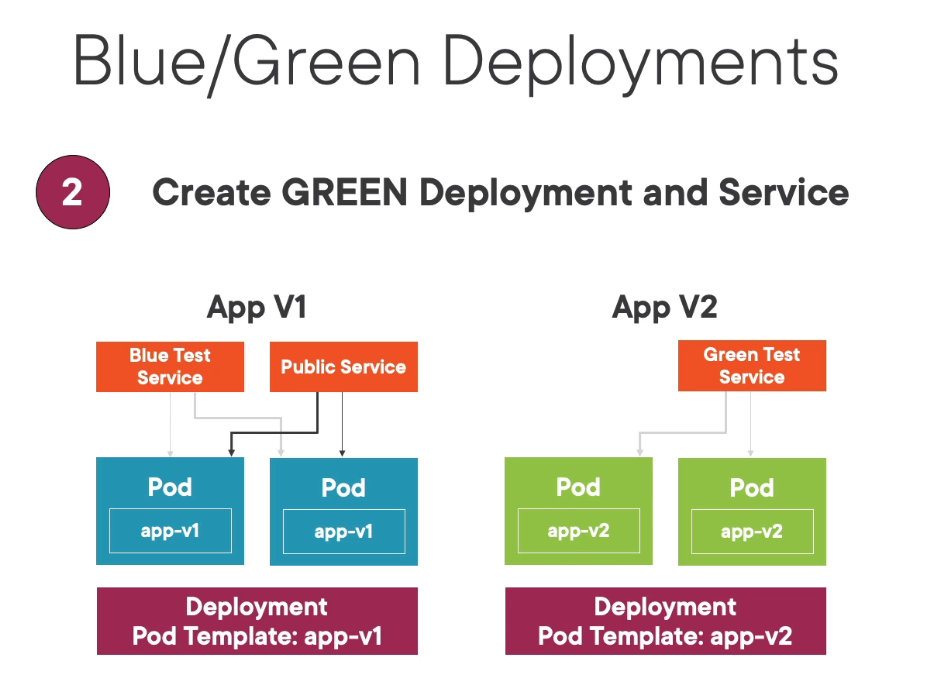
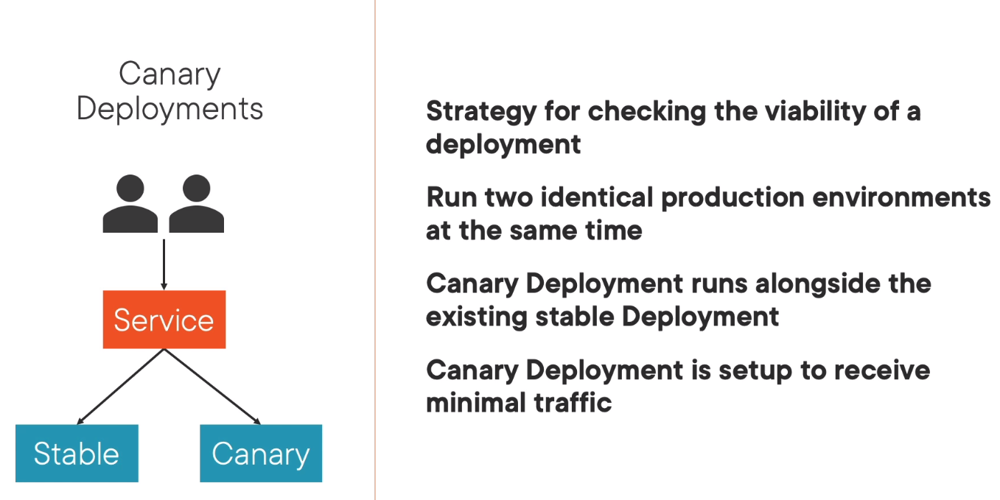

# Common deployment strategies

* Normal deployments
* Blue/Green
* Canary

## Blue/green

New app (green) is deployed alongside old (blue). When checks pass traffic is routed from blue to green. And eventually blue is deleted.

## Canary

