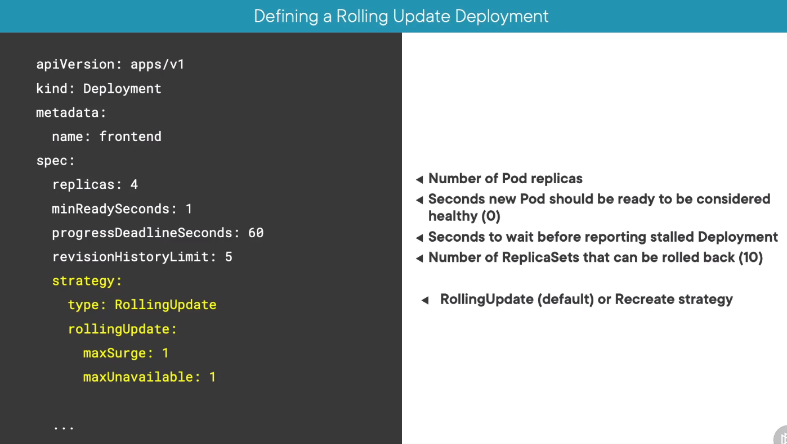
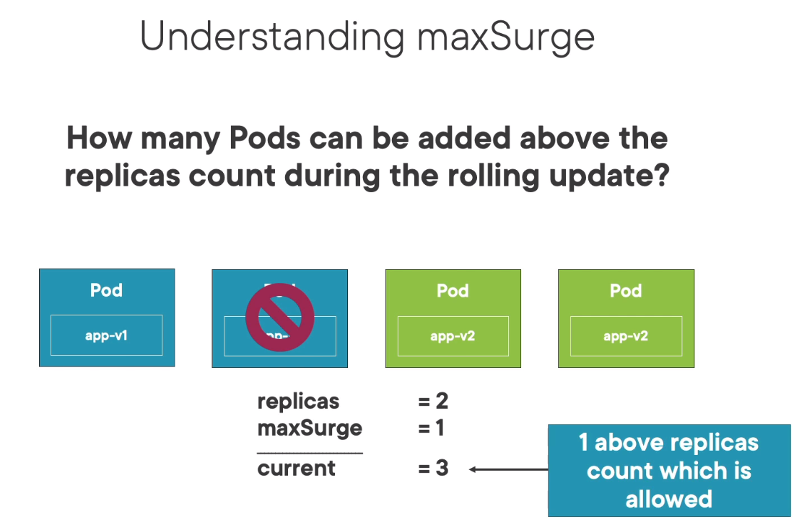
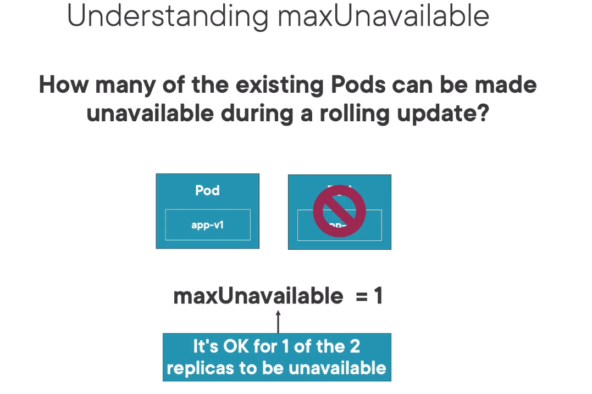
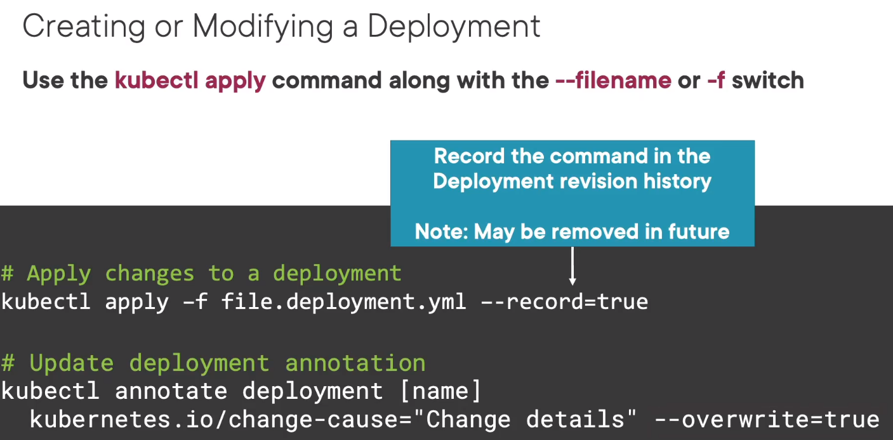

# Rolling updates

Provide a zero-downtime solution

## Available settings in the deployment




## Tricks

Save configuration in resource's annotations:
```
kubectl create -f file-deployment.yaml --save-config
```
