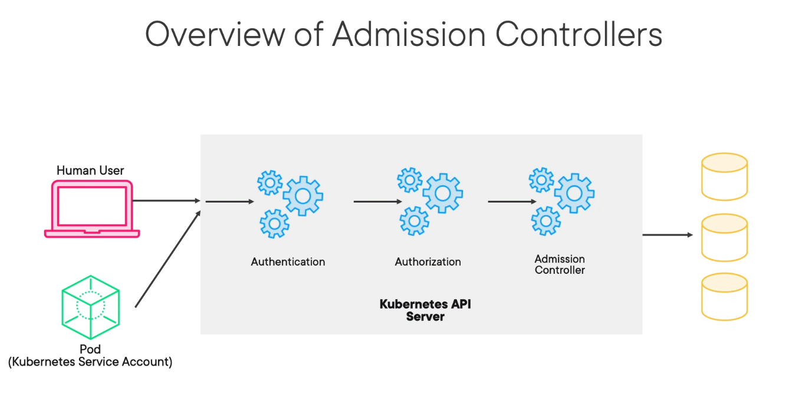
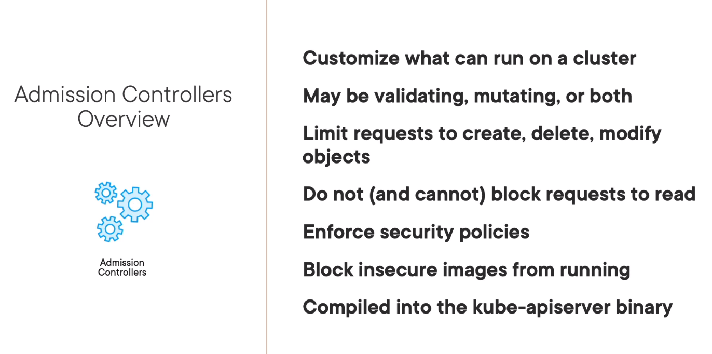
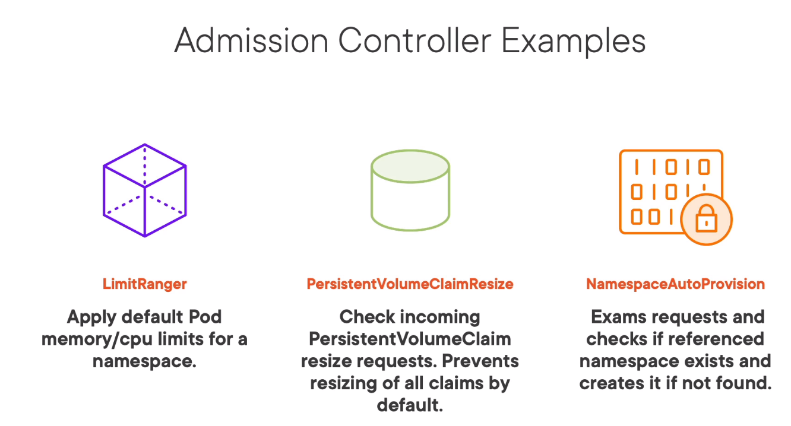
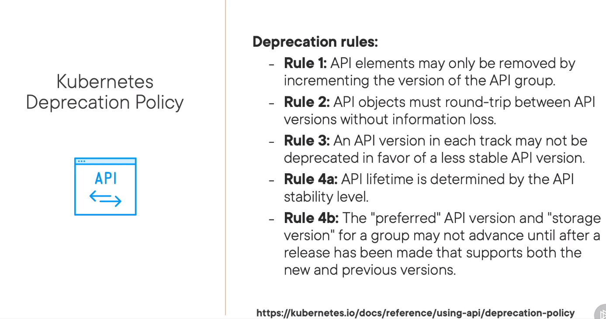
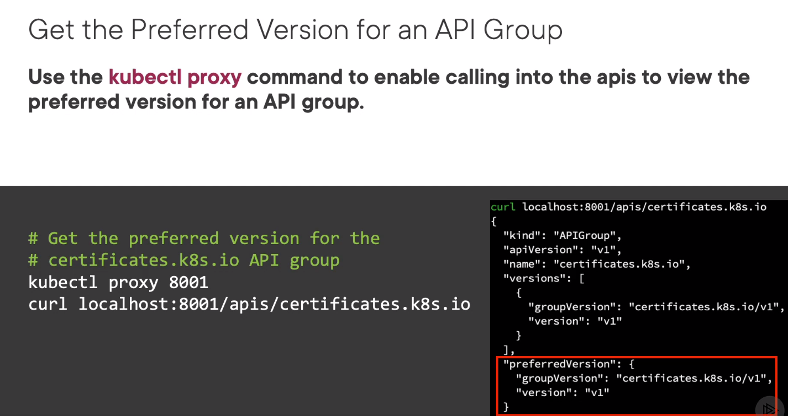

# API Deprecations

## Admission Controllers

An admission controller is a piece of code that intercepts requests to the Kubernetes API server prior to persistence of the object, but after the request is authenticated and authorized.





### Enabling admission controller
_--enable-admission-plugins_ in kube-apiserver

## API Groups

```kubectl api-resources [--sort-by=name]```

To view API resources with a specific API Group:  
``` kubectl api-resources --api-group=rbac.authorization.k8s.io```

### Depracation rules



### Commands

View API group for resource:
```
kubectl explain deploy/cm/cronjobs/...
```
Alpha versions are not enabled by default. If you want to enable check _--runtime-config_ in kube-apiserver.



View API-versions:
```
kubectl api-versions|grep autoscaling
```

Execute help of kube-apiserver binary
```
kubectl exec -it kube-apiserver-pod -n kube-system -- kube-apiserver -h
```