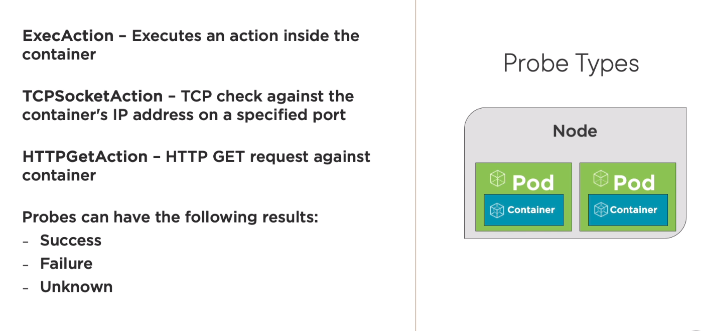
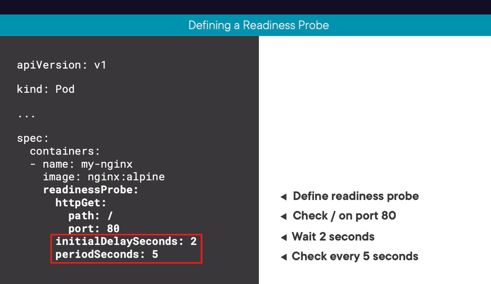
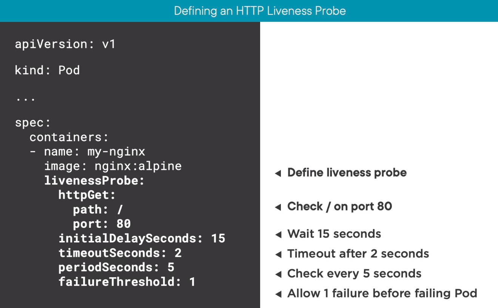
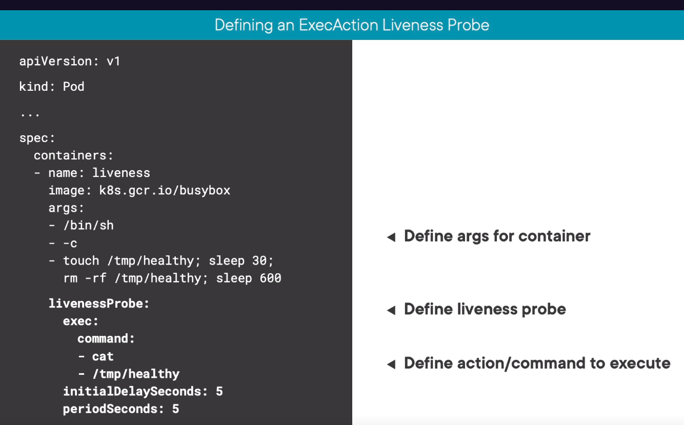

# Probes & health checks

## Probe types

## Readiness probes
Determine when a pod shoould receive traffic.

## Liveness probes
Determine if a pod is healthy or if a restart is required.

## Startup probes
Deprecated, not used much