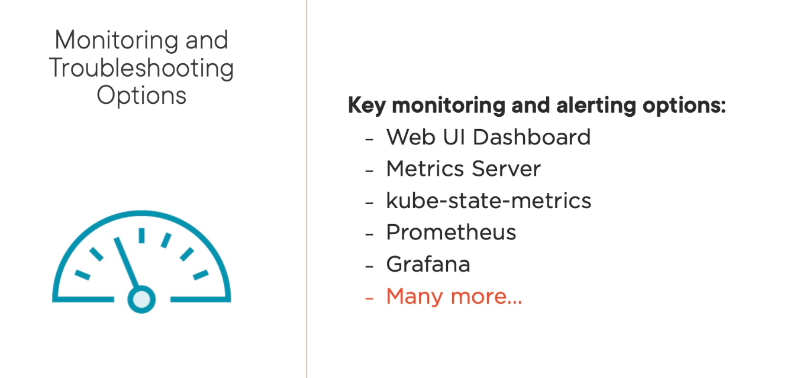
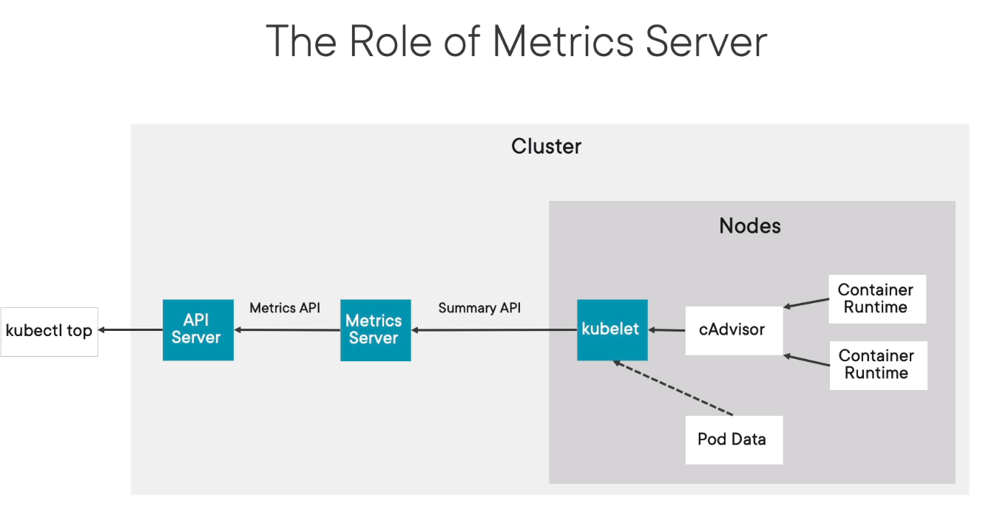

# Monitoring

## Monitoring opitions

## Metrics server

Metrics server collects resource metrics from Kubelets and exposes them in k8s apiserver through Metrics API for use by Horizontal Pod Autoscaler and Vertical Pod Autoscaler. Metrics API can also be accessed by kubectl top, making it easier to debug autoscaling pipelines.

