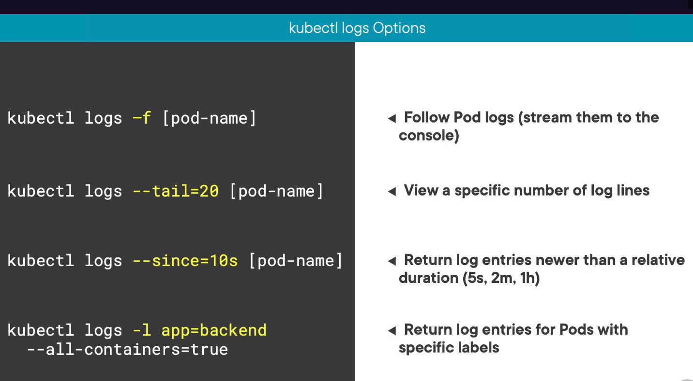

# Logging

By default if a container restarts, the kubelet keeps one terminated container with its logs. If a pod is evicted from the node, all corresponding containers are also evicted, along with their logs.

To view logs of previous pod:
```
kubectl logs -p pod-name [-c specific-container]
```

